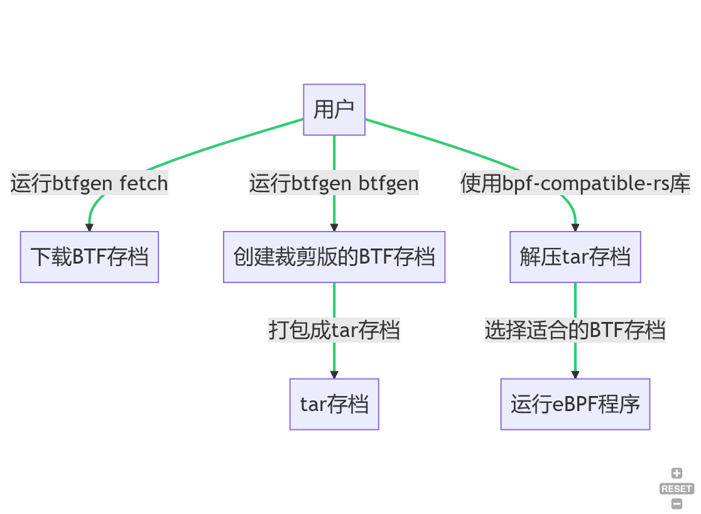

# bpf-compatible

## 简介

这个仓库包含一套工具链，用以实现在不依赖于本地 `BTF` 的情况下， `eBPF` 程序的跨内核版本兼容。

我们基于[`btfhub`](https://github.com/aquasecurity/btfhub-archive)来实现。`btfhub`提供了各种发行版各种内核的预编译好的 `BTF` 存档（包括不支持本地 `BTF` 的内核版本）。

通过这个仓库提供的工具链，你可以从`btfhub`下载你所需要的内核版本的`BTF`存档，而后将这些`BTF`存档进行裁剪，使之仅保留你所写的`eBPF`程序中使用到了的类型，而后将这些裁剪后的`BTF`存档与编译好的`package.json`打包成`tar`存档发布。

而后通过这个仓库中提供的`bpf-compatible-rs`库，用户程序可以加载一个按照上述格式打包好的`tar`存档，从中选取适合当前内核的`BTF`存档，并从`tar`中获取`package.json`。

## 设计

### Tar的结构

```plain
|- package.json <eBPF程序本身>
|- btfhub-archive
|- ---- ubuntu <ID in os-release>
|- ---- ---- 22.04 <VERSION in os-release>
|- ---- ---- ---- x86_64 <machine in uname>
|- ---- ---- ---- ---- 5.15.0-71-generic.btf <kernel-release in uname>
```

一个由此工具链打包出来的`tar`文件的可能结构如上。其中包括由`ecc`所生成的`package.json`，以及一个`btfhub-archive`文件夹。`btfhub-archive`的结构与仓库[`btfhub-archive`](https://github.com/aquasecurity/btfhub-archive)一致，但只保留了其中部分内容（即我们需要的内核的BTF文件）。

### 具体的功能
- 从[`btfhub-archive`](https://github.com/aquasecurity/btfhub-archive)下载所需的内核版本的BTF
- 根据编译好的eBPF程序，对我们需要的BTF存档进行裁剪
- 将裁剪好的BTF与编译好的eBPF程序进行打包
- 解压以tar存档形式发布的 eBPF 程序，从中选取适合当前内核版本的BTF存档并运行

### 工具链

这个仓库所提供的工具链主要包括两部分。

- `script/btfgen`：一个shell脚本，用于从`btfhub-archive`下载BTF存档，以及生成裁剪过的BTF存档
- `bpf-compatible-rs`: 一个`Rust`库，用以提供解压tar存档的支持，以及选择适合当前内核的`BTF`存档的功能。目前`bpf-loader-rs`和`ecli`基于这个库实现了`tar`存档的加载与运行。

### API的设计

`bpf-compitable-rs` 的API主要包含以下两个函数：
- `fn unpack_tar(tar_data: &[u8]) -> Result<(Vec<u8>, BtfArchive)>`：解压一个`tar`存档，读取其`package.json`的内容并返回。如果存档中存在`btfhub-archive`目录，则会一同返回对应的`TempDir`对象及`btfhub-archive`目录的`PathBuf`。
- `fn get_current_system_btf_file( archive_path: impl AsRef<Path>) -> Result<PathBuf>`：从给定的`btfhub-archive`目录中选取适合当前内核的`BTF`存档。

`btfgen` 所提供的功能如下：
- `btfgen fetch`: 从`btfhub-archive`仓库下载`BTF`存档至`~/.cache/eunomia/btfhub`。也可以使用`$BTFHUB_CACHE`来手动指定下载目录
- `btfgen btfgen [-j JSON_FILE] <BPF>`: 基于`<BPF>`所指定的BPF程序，创建裁剪版的`BTF`存档，并打包成`tar`存档。如果指定了`-j`参数，则会将对应的`package.json`一起打包进去。

`bpf-compatible-sys` 是一个用于链接到原有的`libbpf`程序上的适配`bpf-compatible-rs`的接口库，其API包括：
- `int ensure_core_btf_with_linked_tar(char** path)`: 使用程序内弱符号`_binary_min_core_btfs_tar_gz_start`和`_binary_min_core_btfs_tar_gz_end`所指明的字节范围作为tar文件的binary，从中读取当前内核的BTF存档，并在获取成功的情况下将生成的临时文件的路径存储在`path`中。在无法从程序内链接的`tar`中获取当前内核的BTF的情况下，返回对应的errno。
- `int ensure_core_btf_with_tar_binary(char** path, const char* tar_bin, int tar_len)`: 与`ensure_core_btf_with_linked_tar`类似，但是使用参数提供的`tar_binary`
- `int clean_core_btf_rs(char* path)`: 清理临时文件。用户总应该在程序结束前调用此函数清理创建的临时文件

此外，为了便于C程序使用`bpf-compatible-sys`，我们同样需要一个头文件`btf_core.h`。在将`btf-compatible`应用在原有的`libbpf`程序时，用户总应优先考虑此头文件中所定义的函数。这个头文件中包括：
- `bpf-compatible-sys`提供的C函数的原型
- `int ensure_core_btf(struct bpf_object_open_opts *opts)`：使用`btf_context`提供的路径信息填充`opts`中的`btf_custom_path`。此函数尽可能保证了与`bcc`中的[ensure_core_btf](https://github.com/iovisor/bcc/blob/046eea8f64f3dd7bf3a706fabadd8a66eeebb728/libbpf-tools/btf_helpers.c#L165)相同的语义。此函数会调用`ensure_core_btf_with_linked_tar`来实现。
- `int ensure_core_btf_with_tar_binary(struct bpf_object_open_opts *opts, const char* tar_bin, int tar_len)`：与`ensure_core_btf`类似，但是使用参数传入的tar存档。
- `int clean_core_btf(struct bpf_object_open_opts *opts)`: 清理临时文件。用户总应在程序结束前调用此函数进行清理。

此外，为了实现`ensure_core_btf`函数，`btf_core.h`需要包含`libbpf`中的`libbpf.h`。

在应用于`libbpf`程序时，用户可以优先考虑`ensure_core_btf`与`clean_core_btf`。这两个函数提供了与bcc`btf_helper`完全相同的语义。

## 流程图




## 协议

MIT


## 近期目标 / Roadmap
- 实现只裁剪和打包特定内核版本的BTF存档
- 提供一个 example 
- 在 rust 之上提供一个 c header wrapper
- 提供一些兼容性相关的 API，包含 bpf buffer 等
- 发布二进制库和 c 头文件

### 对旧内核的兼容 - 细节

一方面，我们需要保证兼容性，这意味着我们可能需要折中一些特性。例如，高版本内核可能支持 ring buffer，而低版本内核只能使用 perf event。我们需要设计一个能够在两种环境中都能工作的解决方案，例如使用一种 bpf buffer 作为抽象，例如：

https://github.com/iovisor/bcc/blob/master/libbpf-tools/compat.h

```c
typedef int (*bpf_buffer_sample_fn)(void *ctx, void *data, size_t size);
typedef void (*bpf_buffer_lost_fn)(void *ctx, int cpu, __u64 cnt);

struct bpf_buffer *bpf_buffer__new(struct bpf_map *events, struct bpf_map *heap);
int bpf_buffer__open(struct bpf_buffer *buffer, bpf_buffer_sample_fn sample_cb,
		     bpf_buffer_lost_fn lost_cb, void *ctx);
int bpf_buffer__poll(struct bpf_buffer *, int timeout_ms);
void bpf_buffer__free(struct bpf_buffer *);
```
